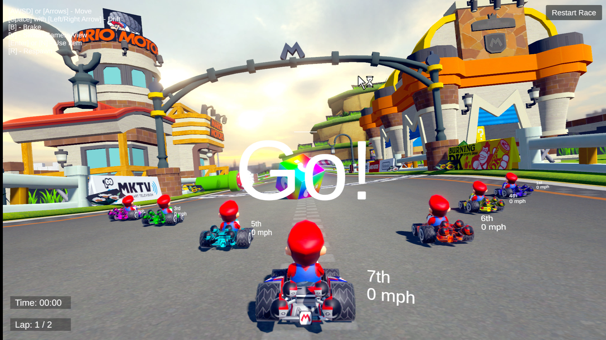
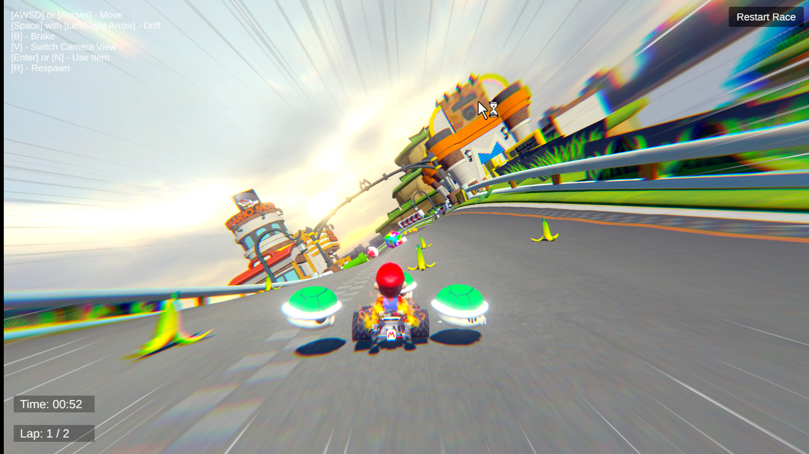
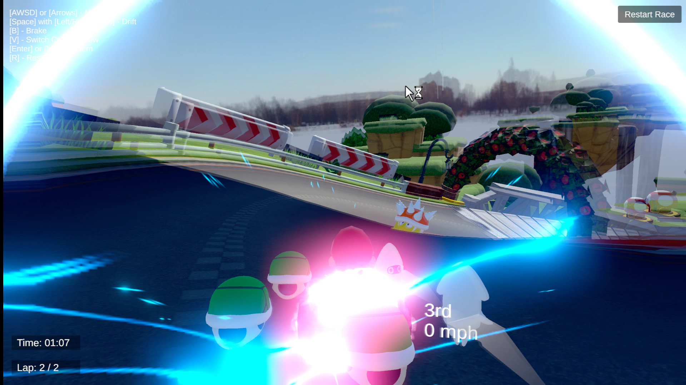

# Mario Kart Demo Game Remade In Unity

Time: Jul 6, 2024 - Jul 16, 2024

A Unity remake prototype of Mario Kart-style movement, pickups, and moment-to-moment kart interactions.

<table>
  <tr>
    <td align="center">
      
    </td>
    <td align="center">
      
    </td>
  </tr>
  <tr>
    <td align="center">
      
    </td>
    <td align="center">
      
    </td>
  </tr>
</table>

<i>(hiekichan: Jul 6, 2024 - Jul 16, 2024)</i>

View project: [GitHub](https://github.com/hieki-chan/Mario-Kart-Demo)
