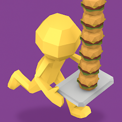
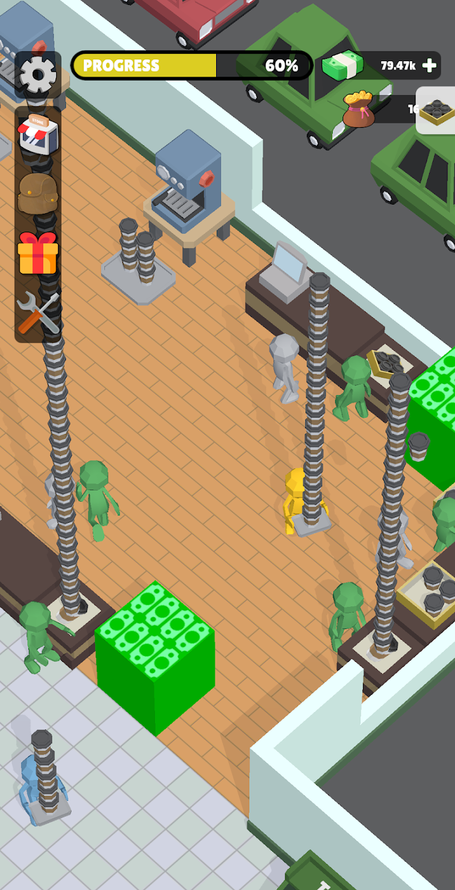
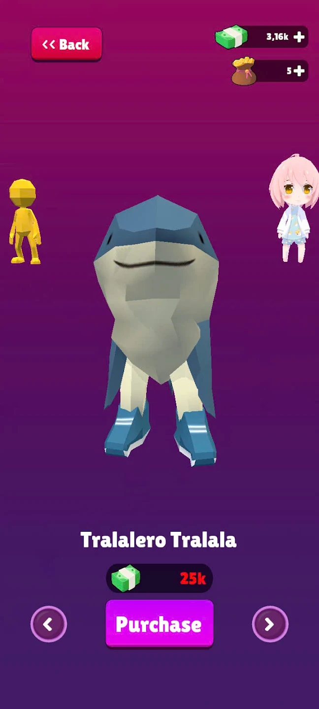
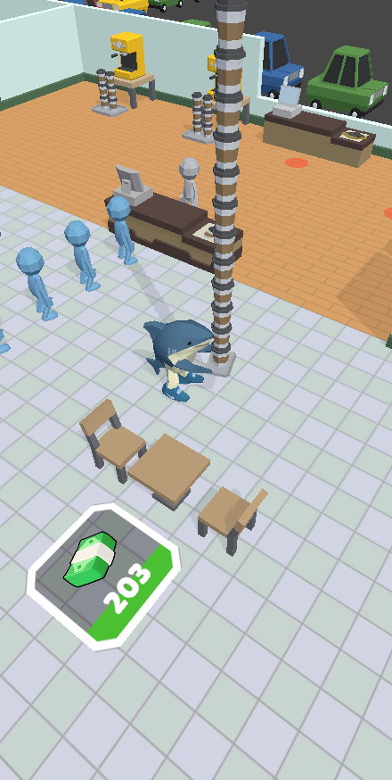
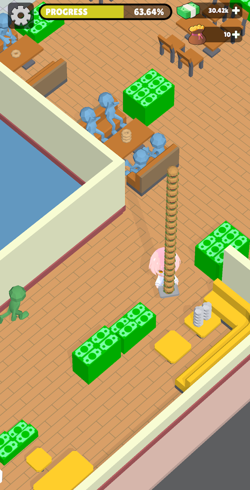
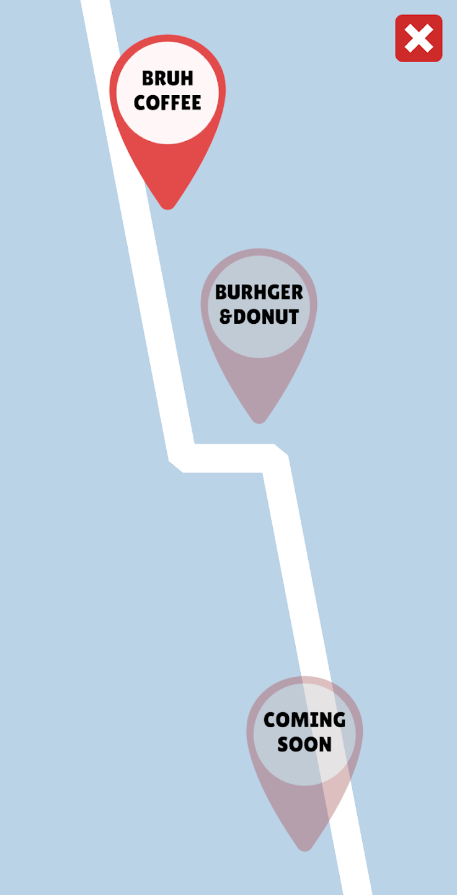
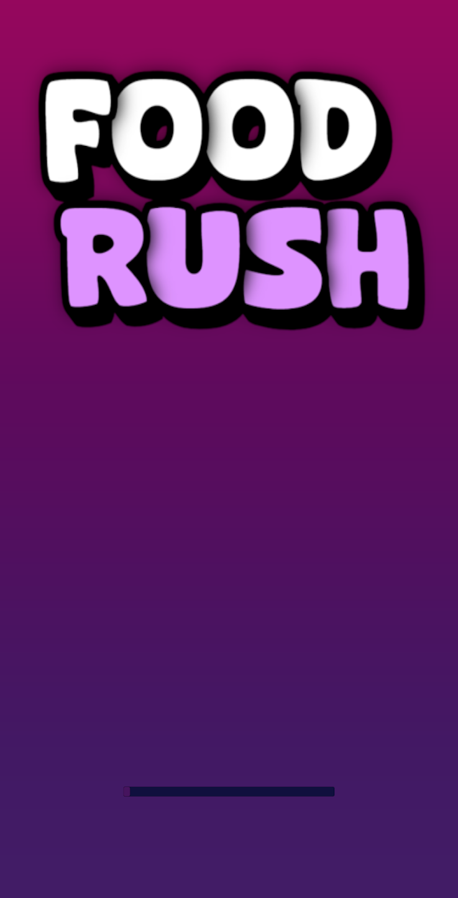

# Food Rush

An Android food-service game built in Unity and published on Google Play.

[Google Play](https://play.google.com/store/apps/details?id=com.lustie.foodgame)

## Store Preview

## Overview

Food Rush is a fast-paced mobile game about serving customers, managing simple orders, and keeping the level flow quick and readable.

## Highlights

- Built the gameplay loop around short sessions and clear customer feedback.
- Tuned level pacing so each stage feels repeatable, readable, and easy to restart.
- Prepared the Android release and published the game on Google Play.

## Tech & Tools

- Unity, C#, Addressables, DoTween, UniTask.
- Firebase Auth, Realtime Database, Remote Config, Analytics, and Crashlytics.
- Google OAuth2, Unity Ads with mediation, Unity IAP, and Google Play publishing.
- Patterns and architecture: Singleton, Object Pool, Observer, PubSub, and MVC.
- Mobile optimization for Android 8.0+, around 60 FPS on the lowest settings.
- Simple Unity CI/CD pipeline with GitHub Actions.
