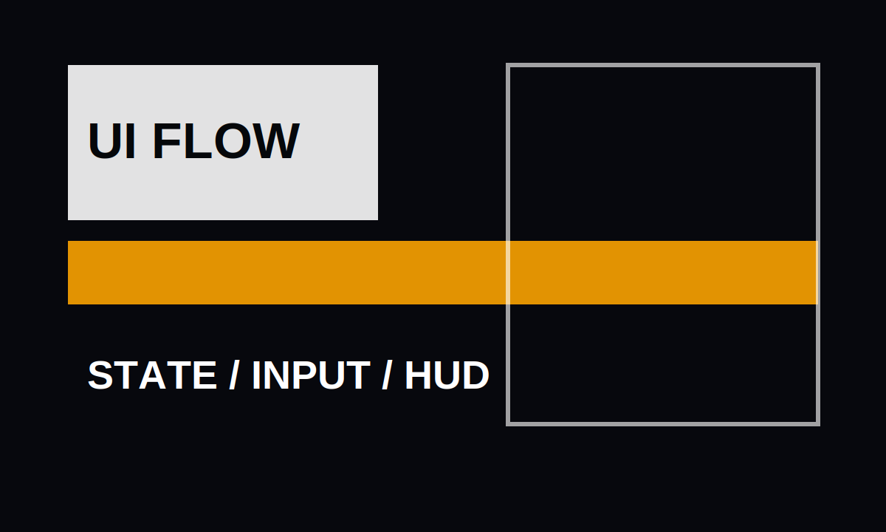

# Gameplay UI Flow

UI work is where state, player intention, and visual clarity meet. This project note is a placeholder for menu/HUD work, but the structure is meant for real production writeups.



## Scope

- Pause and settings flows.
- Inventory/detail panel transitions.
- Result screens and repeated action loops.
- Input-safe navigation between screens.

## Design Rules

1. A player should know where they are.
2. A repeated action should stay fast.
3. State changes should be visible in code and on screen.
4. Polish should come after the core flow is stable.

## Example State Shape

```ts
type ScreenState =
  | { name: "hud" }
  | { name: "inventory"; selectedItemId?: string }
  | { name: "pause"; tab: "settings" | "controls" | "audio" };
```

## Assets

Put screenshots in `public/projects/gameplay-ui/assets/` and reference them with normal markdown:

```md

```
