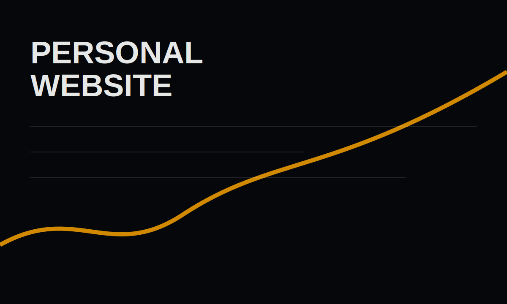

# Personal Website

This project is the site you are looking at: a personal portfolio that treats CV PDFs, project notes, and motion design as one connected experience.



## Goals

- Keep the main page fast and focused around CV access.
- Make the portfolio page easier to expand as new projects appear.
- Store each project in its own folder with `project.md` and local assets.
- Use animation to guide attention without changing layout after the animation ends.

## Implementation Notes

The portfolio loads `projects/index.json`, then fetches each project markdown file in that order. That means project ordering is data-driven and does not require editing React components.

```ts
type ProjectManifestItem = {
  slug: string;
  title: string;
  summary: string;
  markdown: string;
  cover?: string;
  stack?: string[];
};
```

## What To Improve Next

- Add real screenshots once project visuals are ready.
- Add short demo videos in each project folder.
- Add project-specific metadata like role, team size, and release status.
