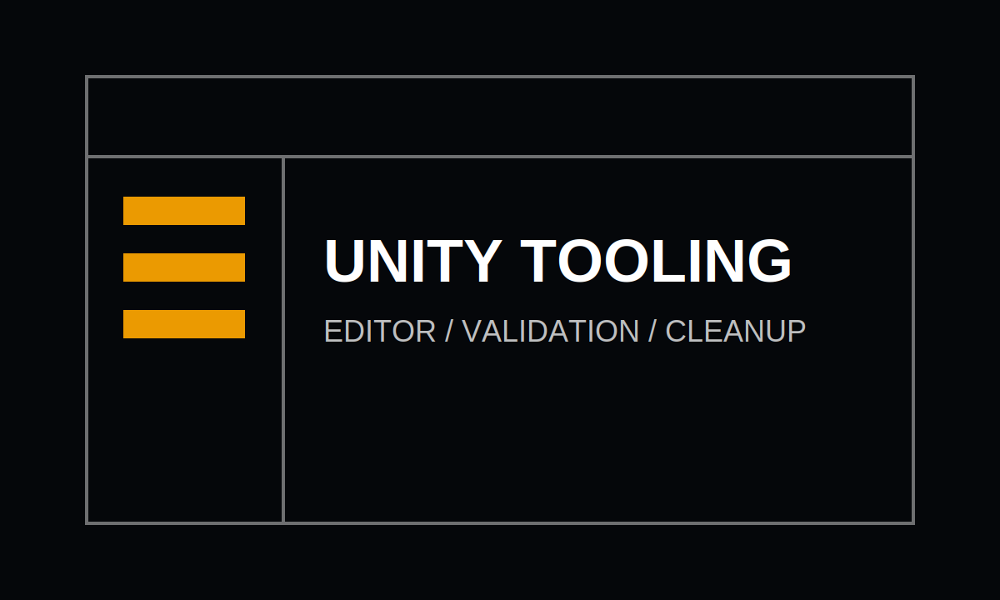

# Unity Tooling

Small editor tools can save a lot of attention. The goal is not to build a giant framework, but to remove repeated manual setup and make project state easier to inspect.



## Useful Tool Categories

- Validation buttons for scene setup.
- Batch prefab cleanup.
- ScriptableObject inspectors for tuning data.
- Build notes and release checklists.

## Tooling Principle

> The best tool is small enough to trust and obvious enough to use without a meeting.

## Example Editor Action

```ts
type CleanupResult = {
  checkedObjects: number;
  fixedObjects: number;
  warnings: string[];
};
```

## Next Notes

This folder can hold screenshots, `.mp4` recordings, exported GIFs, or diagrams for each tool. The renderer supports normal markdown image syntax and video files referenced the same way.
